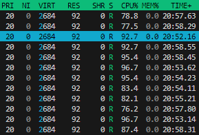
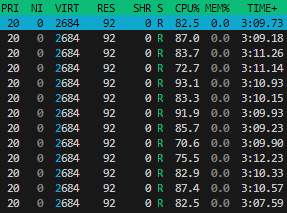
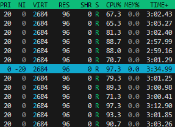
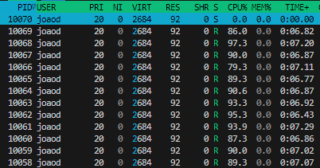
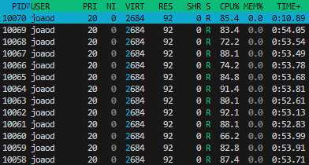

# Tarefa 9: Escalonamento de processos

Aluno: João Victor Moura Lucas da Silva

Descubra o número de núcleos de CPU disponíveis no seu sistema utilizando o comando `nproc`. Com base nesse valor N, crie N processos idênticos que executem laços infinitos para consumir CPU continuamente. Utilize ferramentas como `top`, `htop` ou `ps` para observar como o sistema operacional distribui o uso da CPU entre esses processos. Registre o tempo de CPU consumido, o estado dos processos e verifique se todos recebem tratamento justo.

Em seguida, repita o experimento com N+1 processos. Observe como o sistema lida com a sobrecarga. Todos os processos continuam recebendo tempo de CPU de forma igualitária? Justifique com base nas observações.

Na etapa seguinte, altere a prioridade de um dos processos com o comando `renice`, atribuindo-lhe uma prioridade significativamente mais alta (menor valor de nice). Observe se o uso da CPU por esse processo muda e como isso afeta os demais.

Agora, reinicie o experimento com N processos de carga e adicione um processo adicional que apenas aguarde por entrada do teclado (bloqueado em read). Observe o comportamento desse processo em repouso e após uma entrada ser fornecida. Modifique sua prioridade e verifique se há impacto no uso da CPU.

1. O sistema distribuiu o tempo de CPU de forma justa nos diferentes cenários? Como isso está relacionado ao funcionamento do CFS?
2. O que aconteceu quando a prioridade de um processo foi alterada? Por que isso ocorreu?
3. Por que o processo bloqueado por entrada não utilizou CPU até receber dados?
4. A mudança de prioridade afeta processos bloqueados? Por quê?
5. Compare esse comportamento com o que seria esperado em algoritmos como FIFO, Round Robin e Shortest Job First (SJF).
6. Qual é a vantagem do modelo do Linux em relação aos algoritmos tradicionais?

---

## Corpo da tarefa

### 1. Criação dos processos consumidores de CPU

```c
#include <stdio.h>
#include <unistd.h>
#include <sys/types.h>
#include <stdlib.h>
#define N 12
int main() {
    printf("Threads: %d\n", N);
    for (int i = 0; i < N; i++) {
        if (fork() == 0) {
            while (1);
        }
    }
    while (1);
    return 0;
}
```

#### Resultado da observação com `htop`:




### 2. Criação de N+1 processos consumidores de CPU

```c
// ...código anterior...
#define N 13
// ... código anterior
```


#### Resultado da observação com `htop`:



Processos chegam a uma porcentagem de consumo de CPU menor que no exemplo anterior.


### 3. Alteração de prioridade com renice

Ao usar o comando `renice` para aumentar a prioridade de um processo, nota-se que esse processo passa a consumir mais tempo de CPU em relação aos outros.

#### Resultado da observação após aplicar `renice`:




### 4. Observação do processo bloqueado por entrada junto aos consumidores de CPU

```c
#include <stdio.h>
#include <unistd.h>
#include <sys/types.h>
#include <stdlib.h>
#include <sys/wait.h>
#define N 12
int main() {
    printf("Threads: %d\n", N);
    for (int i = 0; i < N; i++) {
        if (fork() == 0) {
            while (1);
        }
    }
    if (fork() == 0) {
        char buffer[100];
        printf("aguardando entrada...\n");
        scanf("%s", buffer);
        printf("Entrada recebida: %s\n", buffer);
        while (1);
    }
    while(1);
}
```

#### Observação 

- **Antes da entrada:**  
  O processo bloqueado permanece em estado de espera (S) e não consome CPU, enquanto os N processos estão em ação (R).

  

- **Após fornecer a entrada:**  
  Após digitar algo e pressionar Enter, o processo bloqueado passa a executar e pode ser observado consumindo CPU.

  

Ao aumentar para N+1 processos consumidores, observa-se que os processos passam a disputar o tempo de CPU, e cada um recebe uma fração menor, pois há mais processos do que núcleos disponíveis. O processo bloqueado por entrada só passa a disputar CPU após receber a entrada do usuário.

## Respostas

## 1. O sistema distribuiu o tempo de CPU de forma justa nos diferentes cenários? Como isso está relacionado ao funcionamento do CFS?

Sim, o sistema distribuiu o tempo de CPU de forma justa entre os processos consumidores de CPU, especialmente quando o número de processos era igual ao número de núcleos. Isso está relacionado ao funcionamento do CFS (Completely Fair Scheduler), que busca garantir que todos os processos recebam uma fatia justa do tempo de CPU, levando em conta a prioridade (nice) de cada processo.

## 2. O que aconteceu quando a prioridade de um processo foi alterada? Por que isso ocorreu?

Quando a prioridade de um processo foi aumentada (menor valor de nice), ele passou a receber mais tempo de CPU. Isso ocorre porque o CFS utiliza o valor de nice para ajustar a fatia de tempo de CPU destinada a cada processo, favorecendo aqueles com maior prioridade.

## 3. Por que o processo bloqueado por entrada não utilizou CPU até receber dados?

O processo bloqueado por entrada não utilizou CPU porque estava aguardando a entrada do usuário. Enquanto está bloqueado, ele não é escalonado para execução, permanecendo em estado de espera até que os dados sejam fornecidos.

## 4. A mudança de prioridade afeta processos bloqueados? Por quê?

Não, a mudança de prioridade não afeta processos bloqueados, pois eles não estão em execução e não disputam tempo de CPU enquanto aguardam o evento externo. A prioridade só tem efeito quando o processo está apto a ser escalonado.

## 5. Compare esse comportamento com o que seria esperado em algoritmos como FIFO, Round Robin e Shortest Job First (SJF).

- **FIFO:** Processos seriam executados na ordem de chegada, podendo fazer com que processos que chegam depois fiquem esperando por muito tempo.
- **Round Robin:** O tempo de CPU seria dividido igualmente entre todos os processos prontos, independentemente da prioridade.
- **SJF:** Processos com menor tempo estimado de execução seriam priorizados, podendo fazer com que processos longos esperem muito tempo para serem executados.

## 6. Qual é a vantagem do modelo do Linux em relação aos algoritmos tradicionais?

A principal vantagem do modelo do Linux é a capacidade de distribuir o tempo de CPU de forma justa e dinâmica, considerando a prioridade dos processos e evitando que processos fiquem esperando por tempo demais.