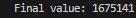

# Tarefa 5: Concorrência com threads
Aluno: João Victor Moura Lucas da Silva


Dado o trecho abaixo em linguagem C:
```c
uint64_t valor = 0;
void *thread(void *arg)
{
    size_t i = 1000000;
    while (i--)
    {
        valor++;
    }
}
```
Adicione ao programa acima uma função main que crie duas threads que executam a função acima concorrentemente e espere que elas terminem; ao final, imprima na tela o valor da variável valor.
Responda:
1. Por que, quando compilado com gcc nas suas configurações padrões, o resultado
não é 2 milhões como é de se esperar?
2. Por que o resultado é 2 milhões quando habilitamos as otimizações do gcc?
3. Com as otimizações habilitadas, seria possível o valor final ser menos de 2 milhões?
Por quê?
4. Descreva uma forma de implementar a função acima que resolve o problema da
contagem errada. Por que ela resolve o problema?

Enviar relatório em PDF com no máximo 4 páginas ou 2000 palavras.

## Corpo da Resposta
```c
int main(void)
{
    pthread_t th, th2;
    int rc = pthread_create(&th, NULL, thread, NULL);
    int rc2 = pthread_create(&th2, NULL, thread, NULL);
    pthread_join(th, NULL);
    pthread_join(th2, NULL);
    printf("Final value of something: %lu\n", valor);
    return 0;
}
```

1. Quando compilado com gcc nas configurações padrão, o resultado não é 2 milhões porque as threads podem ler e escrever na variável ao mesmo tempo, resultando em condições de corrida.
2. Quando habilitamos as otimizações do gcc `-O3`, o compilador pode aplicar técnicas que reduzem a concorrência e garantem que as operações de incremento sejam tratadas de forma mais eficiente, resultando em um valor final correto de 2 milhões.
3. Com as otimizações habilitadas, o valor final não pode ser menos de 2 milhões, pois o compilador garante que as operações de incremento sejam executadas de forma atômica, evitando condições de corrida.
4. Uma forma de implementar a função acima que resolve o problema da contagem errada é usar tipos `_Atomic` para a variável `valor`.